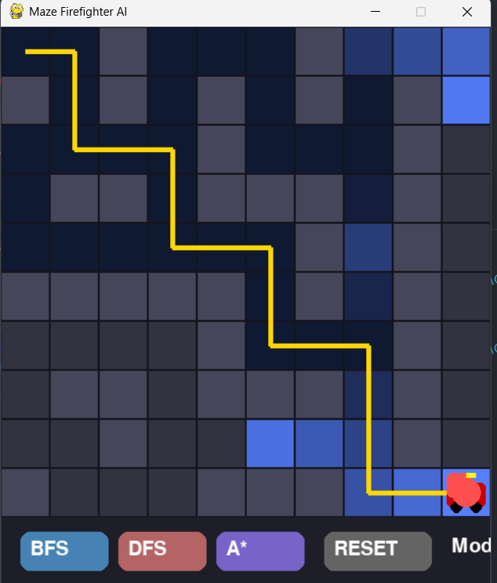

# CNTT18_13_NguyenDucKhoaNhom1: Searching in the State Space
Dự án mô phỏng bài toán tìm đường trong mê cung sử dụng các thuật toán tìm kiếm cơ bản như **BFS (Hàng đợi)** và **DFS (Ngăn xếp)**, kèm theo trực quan hóa bằng Pygame.
## 📁 Cấu trúc thư mục
1. `maps/`: Chứa các bản đồ mê cung (ma trận 2D), bao gồm điểm bắt đầu **S** và điểm đích **G**.
2. `src/core_logic.py`: Chứa các hàm xử lý chung:
    * Xác định vị trí bắt đầu và kết thúc
    * Sinh các ô lân cận hợp lệ
    * In mê cung ra màn hình
3. `src/bfs_solver.py`: Cài đặt thuật toán **tìm kiếm theo chiều rộng (BFS)**
    * Sử dụng cấu trúc dữ liệu **Queue**
    * Có hàm `bfs_step()` hỗ trợ hiển thị từng bước
4. `src/dfs_solver.py`: Cài đặt thuật toán **tìm kiếm theo chiều sâu (DFS)**
    * Sử dụng cấu trúc dữ liệu **Stack**
    * Có hàm `dfs_step()` để trực quan hóa quá trình tìm kiếm
5. `src/main.py`: File thực thi chính
    * Điều khiển chương trình
    * Cho phép chọn thuật toán (BFS / DFS)
    * Hiển thị kết quả và animation bằng **Pygame**
6. `assets/`: (Tuỳ chọn) Chứa hình ảnh/GIF minh họa cho dự án
7. `README.md`: Tài liệu mô tả dự án
## 🧠 Mô tả bài toán
Mê cung được biểu diễn dưới dạng ma trận 2D:
* `S`: Điểm bắt đầu
* `G`: Điểm đích
* `0`: Ô trống (có thể đi)
* `1`: Tường (không thể đi)
Nhiệm vụ: tìm đường từ **S → G**
---

## 🧠 Thuật toán sử dụng
### 🔵 BFS (Breadth-First Search)
* Duyệt theo từng lớp
* Luôn tìm được đường đi ngắn nhất
* Sử dụng **Queue**
---

### 🟣 DFS (Depth-First Search)
* Duyệt theo chiều sâu
* Không đảm bảo đường đi tối ưu
* Sử dụng **Stack**
---
> Mở rộng: Dự án có thể bổ sung thuật toán **A*** để cải thiện hiệu năng tìm đường.
---

## 🎮 Giao diện



---

## 🕹️ Điều khiển

| Nút      | Chức năng            |
| -------- | -------------------- |
| 🔵 BFS   | Chạy thuật toán BFS  |
| 🟣 DFS   | Chạy thuật toán DFS  |
| 🔄 RESET | Reset lại trạng thái |

---
## Trực quan hóa
* ⬛ Tường
* ⬜ Đường đi
* 🔵 Ô đã duyệt
* 🟡 Đường đi đúng
* 🔴 Robot (vị trí hiện tại)
* 🔴 Goal (điểm đích)


## Cách chạy chương trình
### 1. Cài thư viện
```bash
pip install pygame
```
### 2. Chạy chương trình
```bash
python src/main.py
```
## 🔍 Điểm nổi bật

* Trực quan hóa real-time
* Animation từng bước (dùng `yield`)
* So sánh BFS và DFS trực tiếp
* giao diện tương tác
---
## 📌 Hướng phát triển
* [ ] Thêm A*
* [ ] Sinh map ngẫu nhiên
* [ ] Vẽ map bằng chuột
* [ ] So sánh hiệu năng
---
## 👨‍💻 Tác giả
**Khoa Nguyễn**
---
